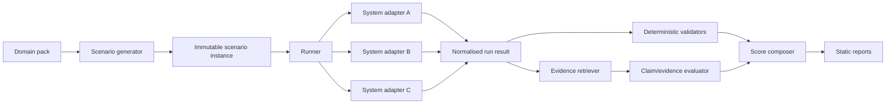

# Architecture

## Design comparison with closed-corpus benchmarks

A closed-corpus benchmark loads a task and its documents into an isolated workspace. OWRB retains the useful separation between task generation, execution, evaluation, and reporting, but replaces supplied documents with a networked retrieval boundary and an evidence ledger.

## Component responsibilities

### Domain loader

- validates manifests and templates;
- resolves files relative to the domain directory;
- records file hashes and versions;
- loads optional plugins through explicit registration.

### Scenario generator

- selects template and parameters with seeded randomness;
- applies compatibility rules;
- renders prompts;
- writes immutable JSON instances.

### Runner

- randomises system order per scenario;
- enforces timeouts and repetition counts;
- calls adapters concurrently within configured limits;
- writes normalised artefacts.

### Adapters

- translate the normalised request to provider or system-specific calls;
- return answer, citations, provider metadata, and telemetry;
- do not perform evaluation.

### Evidence retriever

- waits until candidate runs for a scenario are complete;
- builds a shared evidence bundle from candidate citations and bounded independent corroboration;
- retrieves cited URLs independently from candidates;
- applies SSRF and content safety checks;
- extracts and caches text with hashes and timestamps;
- preserves retrieval failures as data.

### Evaluator

- extracts recommendations and claims;
- runs deterministic checks;
- maps claims to evidence;
- executes rubric and citation-support judges;
- produces criterion-level results.

### Reporter

- creates static HTML and machine-readable summaries;
- compares paired system runs;
- keeps quality and efficiency distinct.

## Plugin boundaries

Use Python entry points or an explicit registry for:

- parameter providers;
- system adapters;
- deterministic validators;
- judge adapters;
- evidence extractors.

Plugins must declare compatibility with a core schema version.

## Dependency rule

Core modules may depend on contracts and utility modules. Domain packs may depend on the public plugin API. The core must never import a particular domain pack or candidate system.
